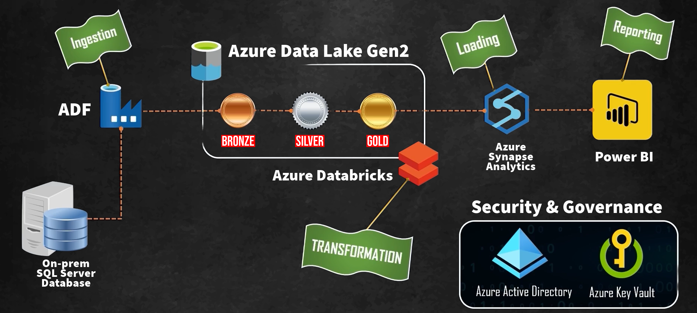

# Sales-Data-Analytics---Azure-End-to-End-Data-Engineering

## Project Summary

This project demonstrates an end-to-end data engineering solution built on Microsoft Azure for sales data analytics. The solution migrates data from an on-premise SQL Server database to the cloud, transforms it through multiple layers, and provides business insights through interactive visualizations.

## Architecture

This project implements a modern lakehouse architecture that combines the flexibility of a data lake with the performance of a data warehouse. Here's how data flows through the system:

1. **Data Ingestion**
   - **Azure Data Factory (ADF)** connects to the on-premise SQL Server database and extracts sales data
   - ADF serves as the orchestration tool for the entire data pipeline, handling both initial full loads and incremental updates
   - Data is ingested into the "Bronze" layer of the data lake, preserving the raw format

2. **Data Storage**
   - **Azure Data Lake Storage Gen2 (ADLS Gen2)** provides the foundation for the multi-layer storage approach
   - The three-tier architecture consists of:
     - **Bronze Layer**: Raw data ingested directly from the source without modifications
     - **Silver Layer**: Cleansed, validated, and conformed data with standardized schemas
     - **Gold Layer**: Business-ready data models optimized for reporting and analytics

3. **Data Transformation**
   - **Azure Databricks** with Apache Spark handles the complex transformation logic between layers
   - PySpark notebooks perform:
     - Bronze to Silver: Data cleansing, validation, and standardization
     - Silver to Gold: Business logic application, dimensional modeling, and aggregations
   - Delta Lake format is used to ensure ACID transactions and time travel capabilities

4. **Data Warehousing**
   - **Azure Synapse Analytics** loads the transformed data from the Gold layer
   - Provides high-performance SQL querying capabilities
   - Implements appropriate distribution and partitioning strategies for optimal performance
   - Serves as the centralized repository for analytical queries

5. **Data Visualization**
   - **Power BI** connects to Azure Synapse to create interactive dashboards
   - Visualizes key sales metrics, trends, and KPIs
   - Enables self-service analytics for business users

6. **Security & Governance**
   - **Azure Active Directory** provides identity management and authentication
   - **Azure Key Vault** securely stores connection strings and credentials
   - Role-based access control (RBAC) ensures appropriate data access permissions
   - End-to-end encryption protects data at rest and in transit

This architecture provides a scalable, secure, and performant foundation for sales data analytics, enabling data-driven decision making across the organization.
